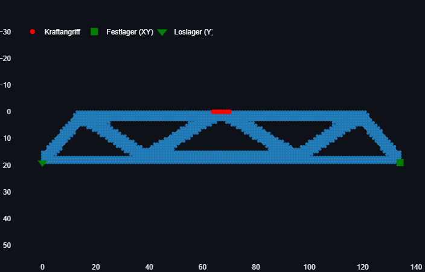
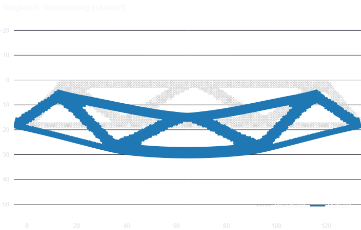
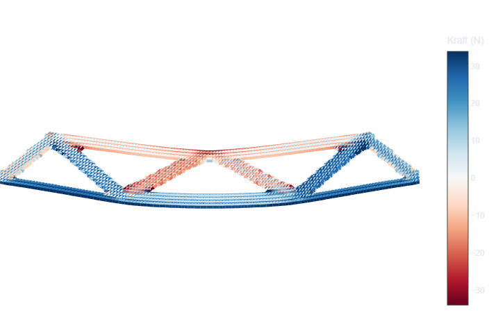
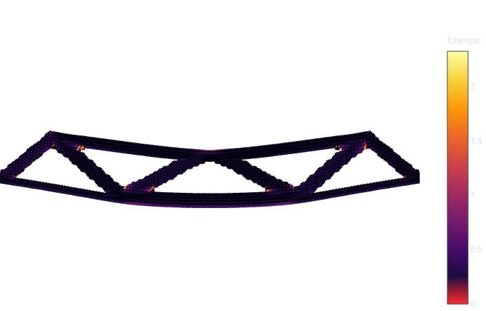
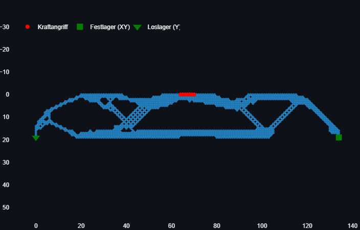
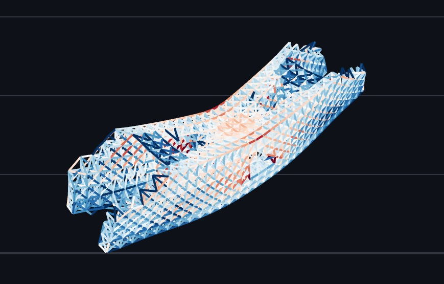
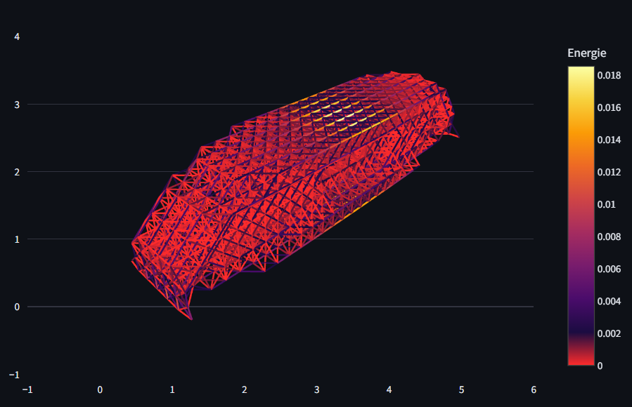
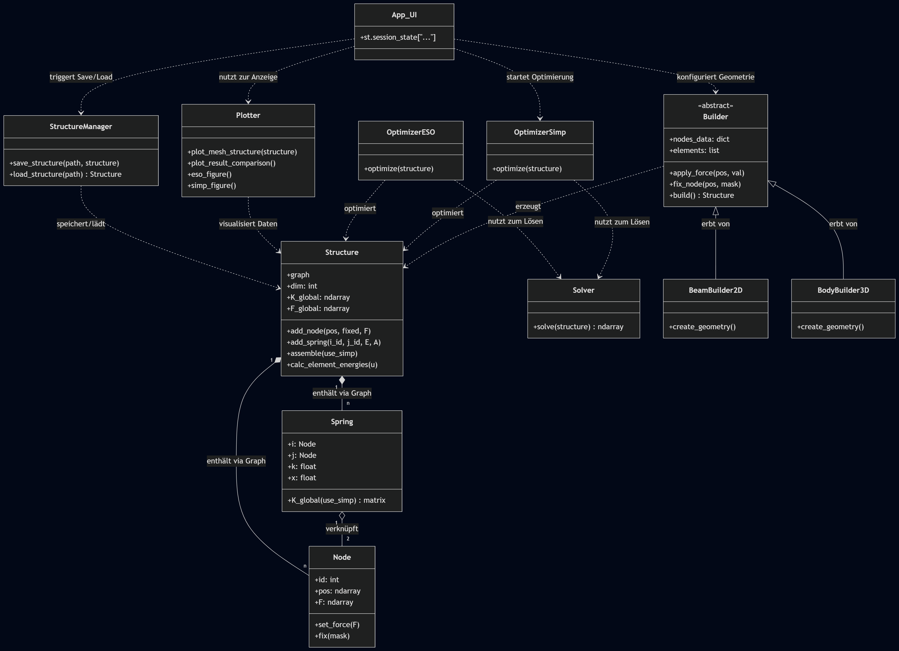

# SD_Abschlussprojekt_LG_JS
### Joachim Spitaler und Leonie Graf

Im Rahmen des Abschlussprojekts in der Vorlesung Softwaredesign (3. Semester Mechatronik) wurde eine Applikation zur Modellierung und Optimierung zwei- und dreidimensionaler Strukturen entwickelt. Das Hauptziel liegt in der topologischen Optimierung der Materialverteilung, um unter Berücksichtigung definierter Randbedingungen und Lastszenarien eine maximale Effizienz bzw. Steifigkeit zu erreichen.

# Installation und Ausführung

Um das Projekt ausführen zu können, muss das Repository geklont, die virtuelle Umgebung erstellt und die Requirements installiert werden. Die Anwendung kann anschließend mit dem Befehl ```streamlit run .\Startseite.py``` lokal gestartet werden. 


Eine weitere Möglichkeit ist das Aufrufen online über die Streamlit Web-App, die sich unter [diesem Link](https://sdabschlussprojektlgjs-7j6rxwkhfreunotlcjq7hf.streamlit.app/) befindet. 


# Minimalanforderungen

 Die definierten Minimalanforderungen wurden zur Gänze erfüllt und sind nachfolgend aufgelistet.

- Programmierung in Python, Benutzeroberfläche umgesetzt mit Streamlit.
- Die Geometrie eines beliebigen 2D-Balkens oder 3D-Körpers wird über ein Eingabefeld definiert. Alle nachfolgenden Funktionen werden automatisch an die gewählte Dimension angepasst.
- Randbedingungen und Kräfte können an jedem Massepunkt der Ausgangsstruktur platziert werden.
- Die Struktur wird bereits bei der Definition der Abmessungen, bei der Wahl der Lager sowie beim Ansetzen der Kräfte visualisiert. Während der Optimierung erscheint nach jeder Iteration ein Plot und anschließend wird die resultierende Verschiebung dargestellt. 
- Die Struktur kann jederzeit gespeichert werden. Durch das Speichern der Randbedingungen und des Optimierungszustands ist ein späteres Laden und Anpassen der Konfiguration problemlos möglich. 
- Die Struktur besteht aus einem Knoten-Federn System, wodurch das FEM Prinzip angewendet ist. 
- Verschiedene Überprüfungen und Fehlermeldungen während der Optimierung vermeiden statisch instabile Systeme. 
- Die Verwendung von Plotly als Visualisierungs-Lösung erlaubt ein einfache Exportieren der Ergebnisse als PNG-Datei. 

Die Benutzeroberfläche enthält zahlreiche Implementierungen und ist intuitiv gestaltet, sodass auf eine detaillierte Erklärung verzichtet werden kann.

# Optimierung des Messerschmitt–Bölkow–Blohm Balkens (MBB)

### 2D SIMP Optimierung

Mit den Einstellungen ```Zielvolumen = 35%, Iterationen = 30, Filter = 1.5, Cleanup = mittel```  ergibt sich folgende Optimierung:
<table width="100%" style="border-collapse: collapse;">

<tr>
<td width="50%" valign="top" align="center"
    style="border-right: 1px solid #444; border-bottom: 1px solid #444;">

<h4>Optimierte Struktur</h4>


</td>

<td width="50%" valign="top" align="center"
    style="border-bottom: 1px solid #444;">

<h4>Verformung</h4>


</td>
</tr>

<tr>
<td width="50%" valign="top" align="center"
    style="border-right: 1px solid #444;">

<h4>Normalkraft-Analyse</h4>


</td>

<td width="50%" valign="top" align="center">

<h4>Federenergien-Analyse</h4>


</td>
</tr>

</table>

### 2D ESO Optimierung
Die Einstellungen ```Zielvolumen = 35%, Aggressivität = 0.3```  führen zum folgenden optimierten Balken:
<div align="center">
    
    <br>
</div>

# Optimierung von 3D Körpern

Bei der Optimierung von 3D-Objekten ist auf eine korrekte Lagerung zu achten. Das Prinzip des zweidimensionalen Balkens kann dabei auf den Körper übertragen werden. Die Unterkante einer Seite wird in XYZ-Richtung gesperrt, während die gegenüberliegende Unterkante nur in X-Richtung beweglich ist.

### 3D SIMP Optimierung

Bei mangelhafter Befestigung funktioniert eine Optimierung mit der SIMP-Methode nicht. Sollte dies dennoch der Fall sein, wird man durch eine Fehlermeldung darauf aufmerksam gemacht. 

Mit den Einstellungen ```Zielvolumen = 30%, Iterationen = 30, Filter = 1.5, Cleanup = hoch``` ergibt sich der optimierte Körper, der nachfolgend anhand seiner Normalkraft-Analyse dargestellt wird.

<div align="center">
    
</div>

### 3D ESO Optimierung

Eine unzureichende Lagerung wird beim ESO Optimierer nicht mit einer Warnmeldung abgefangen. Bei korrekten Randbedingungen werden jedoch sehr gute Ergebnisse geliefert. Mit Optimierungswerten von ```Zielvolumen = 65%, Aggressivität = 0.4```, ergibt sich die folgende Struktur, dargestellt anhand der Federenergien-Analyse. 

<div align="center">
      
    <br>
</div>


  
# Erweiterungen
Zu den Minimalanforderungen wurden zusätzliche Erweiterungen implementiert:

-	Erweiterung auf 3D-Strukturen: Die Benutzeroberfläche passt sich automatisch an die gewählte Dimension an.
-	Implementierung einer weiteren Topologieoptimierung.
-	Durchdachtes User Interface: 
    -	Schnellere Positionierung der Lager durch integrierte Streamlit-Widgets (in 2D und 3D).
    -	Ausgrauen bzw. Deaktivieren von Buttons abhängig von bestimmten Bedingungen.
    -	Kraftangriff durch Slider-Funktionen bestimmen (unterschiedlich in 2D und 3D).
    -	Verschiedene Warnungen verhindern unbeabsichtigte Benutzereingaben (fehlender Input, unzureichende Lagerung, zusätzliche Bestätigung beim Löschen oder Schließen).
    -   Optisch ansprechendes Design (Hintergrundbild auf Startseite, selbstentwickeltes Logo in Sidebar) - Rechte für Bild und Schriftarten sind vorhanden.
-	Sinnvolles Speichermanagement: Hybrides System aus einer JSON Datei und dem Numpy Binär-Format NPZ.
-	Ausführliche Struktur-Analyse: Nach der Optimierung werden neben der optimierten Struktur inklusive Lager und Kräften auch die Verformung, Feder-Energien und Feder-Kräfte anschaulich dargestellt.


# Methodik und Fokus der Implementierung

Im Rahmen des Projekts wurde besonderer Wert auf eine nachvollziehbare und klare Strukturierung gelegt. Dies erreichten wir durch eine logische Verknüpfung der Klassen und eine konsequente Trennung der Funktionalitäten. Das nachstehende UML Diagramm zeigt die Beziehungen zwischen den einzelnen Klassen. 

<div align="center">
    
</div>

## Herausforderungen der ESO-Optimierung

Obwohl der Fokus anfangs auf der vorgeschlagenen **ESO-Optimierung (Evolutionary Structural Optimization)** lag, traten hierbei signifikante Herausforderungen auf. Da das Entfernen von Knoten oft die Integrität des mechanischen Systems gefährdet, haben wir verschiedene Prüfroutinen implementiert, die das System bereits vor dem Löschen auf seine zukünftige Stabilität untersuchen. Da eine lückenlose Prüfung insbesondere bei komplexen Strukturen jedoch zu extrem langen Rechenzeiten führt, lag die größte Schwierigkeit darin, einen effizienten Kompromiss zwischen Rechengeschwindigkeit und Vorhersagegenauigkeit zu finden.

Das Endergebnis der ESO-Implementierung ist somit primär auf eine vertretbare Rechenzeit ausgelegt. Da der Fokus im weiteren Projektverlauf auf das SIMP-Verfahren verlagert wurde, ist dieser Teil nicht voll ausgereift.

## Implementierung des SIMP-Verfahrens

Aufgrund dieser Limitationen haben wir ein zweites Optimierungsverfahren auf Basis eines **SIMP-Modells (Solid Isotropic Material with Penalization)** integriert. Hierbei wird über eine Empfindlichkeitsanalyse der Federelemente die Gesamtnachgiebigkeit minimiert, während ein Lagrange-Verfahren sicherstellt, dass das Zielvolumen als Nebenbedingung eingehalten wird.

Viel Zeit floss dabei in die Performance-Optimierung:

* **Laufzeitanalyse:** Mithilfe von `cProfile` wurden ineffiziente Methoden identifiziert und gezielt eliminiert.
* **Effizienz:** Das Ergebnis ist ein zuverlässiges Verfahren, das selbst große Strukturen schnell und fehlerfrei berechnet.
* **Benutzerkontrolle:** Durch variabel einstellbare Filter (Anpassung der Sensitivität an benachbarte Elemente) und eine steuerbare Struktur-Bereinigung behält der Anwender die volle Kontrolle über das Endergebnis.

## Qualität vor Quantität

Ein weiterer Schwerpunkt war die saubere Einbettung aller Erweiterungen in die Benutzeroberfläche (UI). Um eine möglichst hohe Benutzerfreundlichkeit zu gewährleisten, haben wir das Tool durch externe Testpersonen prüfen lassen. Verschiedene Hilfsfunktionen erleichtern nun die Eingabe der Randbedingungen. Zudem verhindern implementierte Safeguards sowie ein durchdachtes Speichermanagement via `Session States` Bedienfehler und ermöglichen einen flüssigen Workflow. Endergebnisse werden visuell Ansprechend und interaktiv dargestellt.


# Quellen und Ressourcennutzung

Während des Projekts wurde großer Wert darauf gelegt, sämtliche Konzepte eigenständig umzusetzen und zu verstehen. Die gesamte Programmstruktur sowie das User Interface wurden eigenständig konzipiert und ausgearbeitet. Obwohl eine exzessive Kommentierung im professionellen Software-Engineering unüblich ist, wurde sie hier bewusst eingesetzt, um den eigenen Lernprozess zu dokumentieren und die Nachvollziehbarkeit zu erhöhen.

Als Hilfestellung dienten Internet-Recherchen in Fachforen, wissenschaftlichen Papern und Dokumentationen (Reddit, YouTube, Stack Overflow sowie verschiedene Library-Websites).

## Nutzung von Large Language Models (LLMs)

LLMs wurden als Hilfsmittel verwendet, um programmiertechnische Konzepte effizienter aufnehmen zu können. Dabei wurde strikt darauf geachtet, keine fertigen Code-Blöcke blind zu übernehmen. Vielmehr dienten LLMs als Wissensdatenbank, um spezifische Probleme zu diskutieren und Lösungswege zu überprüfen, anstatt die Programmierarbeit auszulagern.

Die KI lieferte bei den folgenden Konzepten die initialen Lösungsansätze:
* **Hybrid-Speichersystem:** Kombination aus JSON- und npz-Dateien für Datenspeicherung.
* **Lagrange-Verfahren:** Einsatz bei der SIMP-Optimierung zur Einhaltung der Nebenbedingungen.
* **Performance-Steigerung:** Vorberechnung benachbarter Knoten bei der SIMP-Optimierung.
* **Rendering:** Nutzung von WebGL für eine effizientere Darstellung der Plots.

### Ausnahme: Enddarstellung der Strukturen
Die einzige Ausnahme bildet die Datei `plots.py`. In der Klasse "Plotter" wurde Code stellenweise direkt von Google Gemini generiert übernommen. Da das Plotten stark von spezifischen Bibliotheks-Optionen abhängt und die optische Anpassung der Darstellung einen hohen zeitlichen Aufwand für "Kleinarbeit" bedeutet, haben wir uns aufgrund von Zeitmangel für diesen Weg entschieden. Der übernommene Code wurde jedoch vollständig überprüft, im Detail nachvollzogen und an unsere Anforderungen angepasst.
