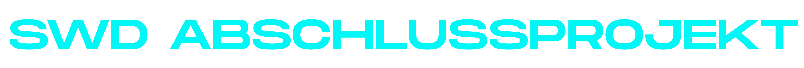
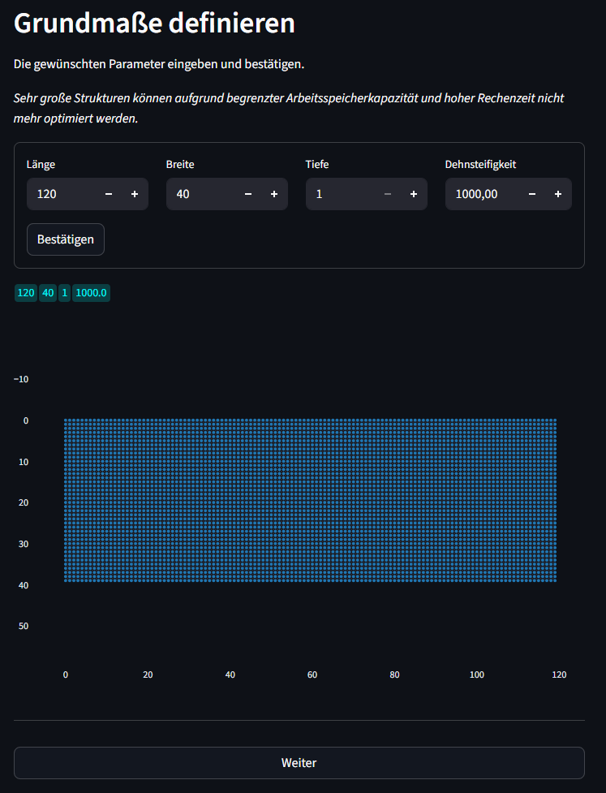
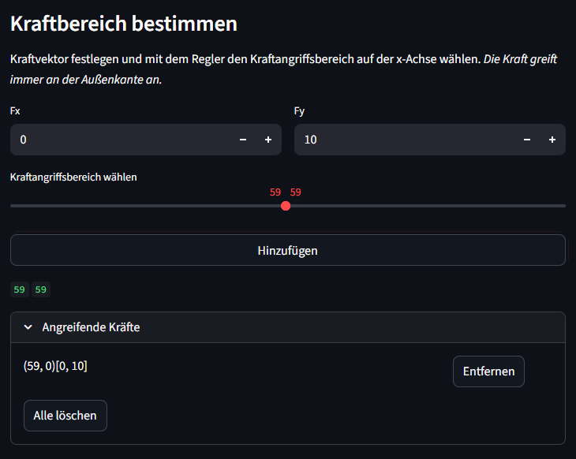
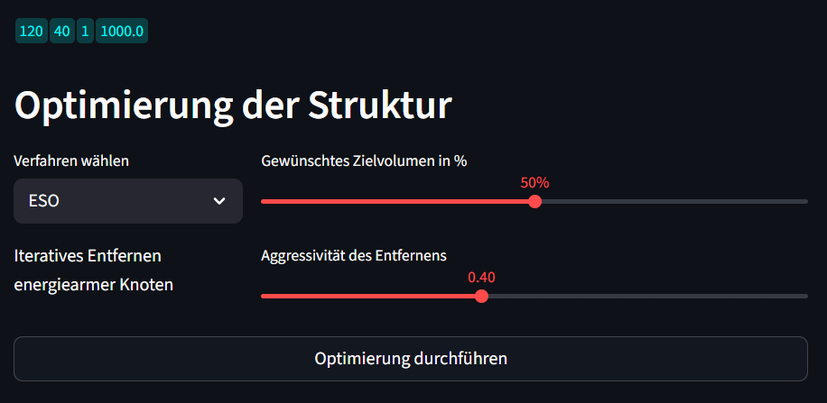

# SD_Abschlussprojekt_LG_JS

## Projektübersicht

...

## Minimalanforderung

Die definierten Minimalanforderungen wurden zur Gänze erfüllt und befinden sich nachfolgend aufgelistet:

- Programmiert mit Python und User Interface umgesetzt mit streamlit.
- Die Geometrie eines beliebigen 2D Balkens und 3D Körpers wird durch das Eingabefeld definiert. Alle nachfolgenden Funktionen werden automatisch an die gewählte Dimension angepasst. 
- Randbedingungen und Kräfte können an jedem Massepunkt der Ausgangsstruktur platziert werden.
- Die Struktur wird bereits beim Definieren der Maße, beim Wählen der Lager und beim Ansetzen der Kräfte dargestellt. Bei der Optimierung erscheint ein Plot nach jeder Iteration und die resultierende Verschiebung wird anschließend dargestellt. 
- Zu jedem Zeitpunkt kann die Struktur in einem Hybrid-System aus einer JSON-Datei und dem Numpy Binär-Format NPZ gespeichert werden. Durch das Speichern der Randbedingungen und des Optimierungszustandes ist ein späteres Laden und Anpassen der Konfiguration problemlos möglich. 
- Die Struktur besteht aus einem Knoten-Federn System, wodurch das FEM Prinzip angewendet ist. 
- Verschiedene Überprüfungen und Fehlermeldungen während der Optimierung vermeiden statisch instabile Systeme. 
- Die Verwendung von Plotly als Visualisierungs-Lösung erlaubt ein einfache Exportieren der Ergebnisse als png-Datei. 

## Anwendung anhand des Messerschmitt–Bölkow–Blohm (MBB)
Um die Nutzung zu verstehen, wird die Anwendung anhand des Messerschmitt-Bölkow-Blohm Balken durchgeführt. 

1) Neue Struktur erstellen. 

2) Die gewünschten Maße der Geometrie eingeben und bestätigen. 

3) Lager und Kräfte ansetzen.
 

4) Einstellungen am Optimierer treffen. 
 

## Erweiterungen

...

# Methodik und Fokus der Implementierung

Im Rahmen des Projekts wurde besonderer Wert auf eine nachvollziehbare und klare Strukturierung gelegt. Dies erreichten wir durch eine logische Verknüpfung der Klassen und eine konsequente Trennung der Funktionalitäten.

## Herausforderungen der ESO-Optimierung

Obwohl der Fokus anfangs auf der vorgeschlagenen **ESO-Optimierung (Evolutionary Structural Optimization)** lag, traten hierbei signifikante Herausforderungen auf. Da das Entfernen von Knoten oft die Integrität des mechanischen Systems gefährdet, haben wir verschiedene Prüfroutinen implementiert, die das System bereits vor dem Löschen auf seine zukünftige Stabilität untersuchen. Da eine lückenlose Prüfung insbesondere bei komplexen Strukturen jedoch zu extrem langen Rechenzeiten führt, lag die größte Schwierigkeit darin, einen effizienten Kompromiss zwischen Rechengeschwindigkeit und Vorhersagegenauigkeit zu finden.

Das Endergebnis der ESO-Implementierung ist somit primär auf eine vertretbare Rechenzeit ausgelegt. Da der Fokus im weiteren Projektverlauf auf das SIMP-Verfahren verlagert wurde, ist dieser Teil nicht voll ausgereift; insbesondere 3D-Strukturen können aufgrund der aktuell noch zu primitiven Prüflogik nur bedingt optimiert werden.

## Implementierung des SIMP-Verfahrens

Aufgrund dieser Limitationen haben wir ein zweites Optimierungsverfahren auf Basis eines **SIMP-Modells (Solid Isotropic Material with Penalization)** integriert. Hierbei wird über eine Empfindlichkeitsanalyse der Federelemente die Gesamtnachgiebigkeit minimiert, während ein Lagrange-Verfahren sicherstellt, dass das Zielvolumen als Nebenbedingung eingehalten wird.

Viel Zeit floss dabei in die Performance-Optimierung:

* **Laufzeitanalyse:** Mithilfe von `cProfile` wurden ineffiziente Methoden identifiziert und gezielt eliminiert.
* **Effizienz:** Das Ergebnis ist ein zuverlässiges Verfahren, das selbst große Strukturen schnell und fehlerfrei berechnet.
* **Benutzerkontrolle:** Durch variabel einstellbare Filter (Anpassung der Sensitivität an benachbarte Elemente) und eine steuerbare Struktur-Bereinigung behält der Anwender die volle Kontrolle über das Endergebnis.

## Qualität vor Quantität

Ein weiterer Schwerpunkt war die saubere Einbettung aller Erweiterungen in die Benutzeroberfläche (UI). Um eine möglichst hohe Benutzerfreundlichkeit zu gewährleisten, haben wir das Tool durch externe Testpersonen prüfen lassen. Verschiedene Hilfsfunktionen erleichtern nun die Eingabe der Randbedingungen. Zudem verhindern implementierte Safeguards sowie ein durchdachtes Speichermanagement via `Session States` Bedienfehler und ermöglichen einen flüssigen Workflow. Endergebnisse werden visuell Ansprechend und interaktiv dargestellt.

# Quellen und Ressourcennutzung

Während des Projekts wurde großer Wert darauf gelegt, sämtliche Konzepte eigenständig umzusetzen und zu verstehen. Die gesamte Programmstruktur sowie das User Interface wurden eigenständig konzipiert und ausgearbeitet. Obwohl eine exzessive Kommentierung im professionellen Software-Engineering unüblich ist, wurde sie hier bewusst eingesetzt, um den eigenen Lernprozess zu dokumentieren und die Nachvollziehbarkeit zu erhöhen.

Als Hilfestellung dienten Internet-Recherchen in Fachforen, wissenschaftlichen Papern und Dokumentationen (Reddit, YouTube, Stack Overflow sowie verschiedene Library-Websites).

## Nutzung von Large Language Models (LLMs)

LLMs wurden als Hilfsmittel verwendet, um programmiertechnische Konzepte effizienter aufnehmen zu können. Dabei wurde strikt darauf geachtet, keine fertigen Code-Blöcke blind zu übernehmen. Vielmehr dienten LLMs als Wissensdatenbank, um spezifische Probleme zu diskutieren und Lösungswege zu überprüfen, anstatt die Programmierarbeit auszulagern.

Die KI lieferte bei den folgenden Konzepten die initialen Lösungsansätze:
* **Hybrid-Speichersystem:** Kombination aus JSON- und npz-Dateien für Datenspeicherung.
* **Lagrange-Verfahren:** Einsatz bei der SIMP-Optimierung zur Einhaltung der Nebenbedingungen.
* **Performance-Steigerung:** Vorberechnung benachbarter Knoten bei der SIMP-Optimierung.
* **Rendering:** Nutzung von WebGL für eine effizientere Darstellung der Plots.

### Ausnahme: Enddarstellung der Strukturen
Die einzige Ausnahme bildet die Datei `plots.py`. In der Klasse "Plotter" wurde Code stellenweise direkt von Google Gemini generiert übernommen. Da das Plotten stark von spezifischen Bibliotheks-Optionen abhängt und die optische Anpassung der Darstellung einen hohen zeitlichen Aufwand für "Kleinarbeit" bedeutet, haben wir uns aufgrund von Zeitmangel für diesen Weg entschieden. Der übernommene Code wurde jedoch vollständig überprüft, im Detail nachvollzogen und an unsere Anforderungen angepasst.